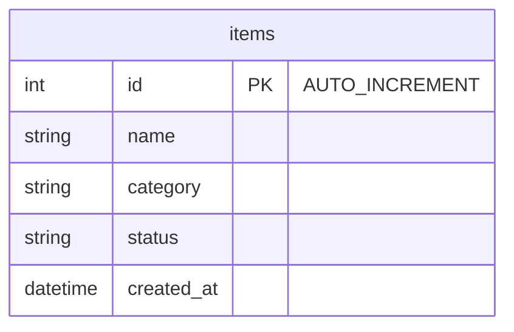

# Flask CRUD App

A modular CRUD application built with Flask, MySQL, and PyMySQL. It includes pagination, search, sorting, filtering, and create/read/update/delete actions.

## Project Structure
```text
flask_crud_app/
├── __init__.py          # Flask Application Factory (create_app)
├── models/              # MySQL DB connection & table schema
├── routes/              # Flask Blueprints (item CRUD routes)
├── static/              # CSS assets
├── templates/           # Jinja2 HTML templates
└── utils/               # Query building & pagination helpers
```

## Tech Stack
- Python 3.11+
- Flask
- MySQL (PyMySQL)
- Jinja2 templates
- HTML/CSS
- Pytest for testing

## How to Start
1. Open the project folder:
   ```bash
   cd flask_crud_app
   ```
2. Activate virtual environment:
   ```bash
   .venv\Scripts\activate
   ```
3. Install dependencies:
   ```bash
   pip install -r requirements.txt
   ```
4. Configure MySQL environment variables (optional if using default `localhost:3306`, user: `root`, password: `7410`):
   ```powershell
   $env:MYSQL_HOST="localhost"
   $env:MYSQL_PORT="3306"
   $env:MYSQL_USER="root"
   $env:MYSQL_PASSWORD="7410"
   $env:MYSQL_DB="flask_crud"
   ```
5. Start the application:
   ```bash
   python -m flask --app flask_crud_app run --host 127.0.0.1 --port 5000
   ```
6. Open the app in your browser:
   ```text
   http://127.0.0.1:5000/
   ```

## Database Schema

