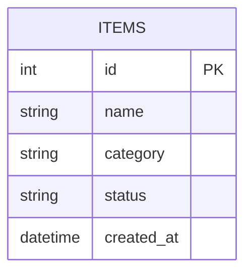

# Flask CRUD App

A polished CRUD application built with Flask, SQLite, and a responsive UI. It includes pagination, search, sorting, filtering, and create/read/update/delete actions.

## Project Scope
This project is focused on a Flask CRUD application with these requested features only:
- Create, read, update, and delete records
- Pagination
- Searching
- Sorting
- Filtering
- Improved and user-friendly UI

## Tech Stack
- Python 3.11+
- Flask
- SQLite
- Jinja2 templates
- HTML/CSS
- Pytest for testing

## How to Start
1. Open the project folder:
   ```bash
   cd "C:\Users\Rosha\OneDrive\Desktop\django R\flask_crud_app"
   ```
2. Create and activate a virtual environment:
   ```bash
   python -m venv .venv
   .venv\Scripts\activate
   ```
3. Install dependencies:
   ```bash
   pip install -r requirements.txt
   ```
4. Start the application:
   ```bash
   python -m flask --app flask_crud_app.app run --host 127.0.0.1 --port 5000
   ```
5. Open the app in your browser:
   ```text
   http://127.0.0.1:5000/
   ```

## Database Diagram


## Git
To initialize a local Git repository and commit the project:
```bash
git init
git add .
git commit -m "Initial Flask CRUD app"
```
